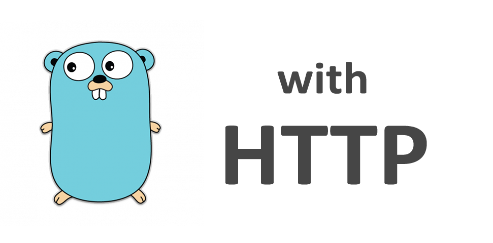

# Learn Web Programming in Go by Examples

[Learn Web Programming in Go by Examples](https://gowebexamples.com/) is an awesome learning resource for Golang beginner. All examples source code can be find in this repository.

## About the Go programming language

Go is an open source programming language designed for building simple, fast, and reliable software. Take a look here which great companies use Go to power their services.

Go Web Examples provides easy to understand code snippets on how to do web development in the Go programming language. It is inspired by Go By Example, which has a great introduction into the fundamentals of this language.

If you are learning web programming in Go or just starting out you can find some good examples and tutorials here. Our goal is it to provide clean examples with great detail, so you can become the next Go web developer! Go Web Examples covers the basics of web programming. From routers and templates to middleware and websockets. Here you can find clean code snippets up to detailed tutorials.

To get things started, check out the first example on how to create a classical "Hello World" web application or go straight to Routing (using the gorilla/mux router).

## Examples

### Hello World

This examples shows how to create an HTTP server using the net/http package from the standard library. It contains all functionalities about the HTTP protocol. 

[Go to Tutorial](https://gowebexamples.com/hello-world/)

### HTTP Server

This example shows how to use the `net/http` package to create a HTTP server with handlers and static files. 

[Go to Tutorial](https://gowebexamples.com/http-server/)

### Routing (using gorilla/mux)

This example shows how to use the `gorilla/mux` package to create routes with named parameters, GET/POST handlers and domain restrictions. 

[Go to Tutorial](https://gowebexamples.com/routes-using-gorilla-mux/)

### JSON

This example will show how to encode and decode JSON data using the encoding/json package in the Go programming language.

[Go to Tutorial](https://gowebexamples.com/json/)

### Middleware (Basic)

This example will show how to create basic logging middleware in the Go programming language.

[Go to Tutorial](https://gowebexamples.com/basic-middleware/)

### Middleware (Advanced)

This example will show how to create a more advanced version of middleware in the Go programming language.

[Go to Tutorial](https://gowebexamples.com/advanced-middleware/)
